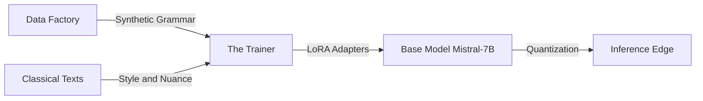

# Approach to Solution: Paninian Engine Architecture

This architecture is **Neuro-Symbolic**: it uses a deterministic "Rule Engine" (Symbolic) to teach a probabilistic "Neural Network" (Neuro).

The **Paninian Engine** is a dual-path system that constructs Sanskrit according to strict Paninian rules rather than just predicting the next word. It operates as:

- **Path A (Constructor)**: English/Transliterated Sanskrit → Perfect Sanskrit Output
- **Path B (Auditor)**: Sanskrit (transliterated or Devanagari) → Grammar Validation & Correction

## 📚 Learning Resources

The best resource for students to visualize this interaction is the recent practical breakdown of **Neuro-Symbolic AI in the Era of LLMs**.

This video is superior for "homework" because it doesn't just talk theory; it demonstrates how to enforce structured logic (like Panini's grammar) onto the probabilistic output of an LLM.

- [**Neuro-Symbolic AI in the Era of LLMs**](https://www.youtube.com/watch?v=cVRNIRZ5K24)

This video perfectly illustrates the "Panini-1" concept by showing how to combine the reliability of rule-based logic (Knowledge Graphs/Constraints) with the flexibility of Large Language Models.

- [**Theoretical Knowledge - Neuro-Symbolic AI**](https://www.youtube.com/watch?v=9Jc3g6sPpUU)

---

## 🛠️ Tech Stack

- **Language**: Python (Orchestration), Rust (Performance - using Vidyut libraries)
- **Containerization**: Docker (essential for students to run this without "dependency hell")
- **Compute**: Single Consumer GPU (NVIDIA RTX 3090/4090, 24GB VRAM)

---

## 🏗️ Architecture Diagram



---

## A. The Data Factory (The "Paninian Engine")

**Objective:** Generate infinite, grammatically perfect Sanskrit text using Paninian rules.

**Core Innovation:** The Paninian Engine operates as a **Dual-Path System**:
- **Path A (Constructor):** English/Transliterated Sanskrit → Paninian Logic → Perfect Sanskrit Output
- **Path B (Auditor):** Sanskrit (transliterated or Devanagari) → Rule Validation → Grammar Correction

**Core Technology:** Python scripts calling Rust-based libraries (e.g., Vidyut or Dhatupatha parsers).

### Path A: Constructor (English/Transliterated Sanskrit → Sanskrit)

**Approach:** Intent-to-Structure translation (not statistical mapping)

**Input Types:**
1. **English Sentences**: "The boy reads the book"
2. **Transliterated Sanskrit**: "Ramah griham gacchati" (Sanskrit in Roman script)

**Processing Steps:**

**For English Input:**
1. **Semantic Parsing:** Extract Karaka (Actor, Object, Instrument) from English
2. **Root Mapping:** Map English words to Sanskrit roots (Dhatu/Pratipadika)
3. **Paninian Assembly:** Apply Ashtadhyayi rules to construct perfect Sanskrit

**Example:**
```
Input:  "The boy reads the book"
Step 1: Extract Karaka → Karta: boy, Karma: book, Kriya: reads
Step 2: Map roots → Baala, Pustaka, √path
Step 3: Apply rules → Baalah pustakam pathati
Output: "Baalah pustakam pathati" (or "बालः पुस्तकं पठति" in Devanagari)
```

**For Transliterated Sanskrit Input:**
1. **Transliteration Normalization:** Detect and normalize transliteration scheme (IAST, ITRANS, etc.)
2. **Sanskrit Parsing:** Parse Sanskrit text in Roman script
3. **Paninian Validation:** Validate and correct grammar
4. **Script Conversion:** Optionally convert to Devanagari

**Example:**
```
Input:  "Ramah griham gacchati" (transliterated Sanskrit)
Step 1: Normalize transliteration (IAST)
Step 2: Parse Sanskrit structure
Step 3: Validate grammar (correct)
Step 4: Convert to Devanagari: "रामः गृहं गच्छति"
Output: "रामः गृहं गच्छति" (or keep in transliteration)
```

### Path B: Auditor (Sanskrit → Validation)

**Approach:** Deconstruction → Rule Check → Correction

**Input Types:**
1. **Transliterated Sanskrit**: "Ramena griham gacchati" (Roman script)
2. **Devanagari Sanskrit**: "रमेण गृहं गच्छति" (Devanagari script)

**Processing Steps:**
1. **Script Detection & Normalization:** Detect script and normalize to standard format
2. **Deconstruction:** Parse Sanskrit text into tokens and cases
3. **Rule Check:** Validate against Paninian rules
4. **Correction:** Suggest fixes for violations
5. **Script Conversion:** Output in user's preferred script

**Example:**
```
Input:  "Ramena griham gacchati" (incorrect: Instrumental case)
        OR "रमेण गृहं गच्छति"
Step 1: Detect script → Normalize
Step 2: Parse → Ramena (Instrumental/Tritiya), gacchati (Active verb)
Step 3: Check → Active verb requires Nominative case
Step 4: Correct → Ramah (Nominative)
Output: "Ramah griham gacchati" (or "रामः गृहं गच्छति")
```

### Curriculum Learning Data Generation

The training data is organized in three progressive stages, mimicking how a student learns Sanskrit:

**Stage 1: Dhatu-Patha (Morphology)**
- **Goal:** Hard-wire grammar tables into model weights
- **Data:** Millions of synthetic word forms from Vidyut
- **Focus:** Word formation from roots
  - Verb conjugation (Tinganta): Root + Tense + Person + Number → Verb form
  - Noun declension (Subanta): Pratipadika + Case + Number → Noun form
  - Sandhi rules: Word combination
- **Example:** Root: √gam + Present + 3rd Person + Singular → Gacchati
- **Why:** This "pre-teaches" the model tokenization logic and grammar tables before it tries to understand meaning

**Stage 2: Karaka (Syntax & Translation)**
- **Goal:** Teach sentence construction and English-to-Sanskrit translation
- **Data:** Parallel corpus (English-Sanskrit)
  - IIT Bombay English-Sanskrit Corpus
  - Samskrita Bharati texts
  - Manually curated translation pairs
- **Focus:** 
  - Karaka-Vibhakti mapping (semantic roles to case endings)
  - English-to-Sanskrit translation
  - Sentence structure
- **Example:** "The boy reads the book" → "Baalah pustakam pathati"
- **Constraint:** Heavy penalty during training for wrong case endings (Vibhakti errors)
- **Why:** Teaches the model to map semantic intent to grammatical structure

**Stage 3: Kavya (Style & Essay Writing)**
- **Goal:** Evolve from sentences to long-form essays
- **Data:** Classical literature
  - The Panchatantra
  - Hitopadesha
  - Kalidasa's works (Meghaduta, Raghuvamsha)
- **Focus:**
  - Long-context generation
  - Stylistic variation
  - Literary devices
  - Contextual coherence
- **Example:** "Write a paragraph about truth" → [Long-form Sanskrit essay in Kalidasa's style]
- **Mechanism:** Model uses Kalidasa's vocabulary but strict grammar structure from Stage 1
- **Why:** Enables the model to generate stylistically rich, grammatically perfect long-form text

**Generator (Rust/Python):** A script that systematically applies rules (Sandhi, Samasa, Subanta) to roots to generate millions of grammatically perfect synthetic sentences.

**Curator:** A mixing script that blends:

- **50% Synthetic** (Perfect Grammar - Stage 1: Dhatu-Patha)
- **30% Translation Pairs** (English-Sanskrit - Stage 2: Karaka)
- **20% Classical Literature** (Kalidasa, etc. - Stage 3: Kavya)

---

## B. The Trainer (The "Classroom")

**Objective:** Teach the model to construct Sanskrit according to Paninian rules through progressive curriculum learning.

**Core Technology:** Unsloth (for efficient training) + PyTorch.

**Hardware Target:** Single NVIDIA RTX 3090/4090 (24GB VRAM).

**Methodology: Curriculum Learning (3 Stages)**

The model learns progressively, just like a student learning Sanskrit:

### Stage 1: Dhatu-Patha (Morphology)
**Goal:** Hard-wire grammar tables into model weights

**Training Process:**
1. **Base Model:** Load Mistral-7B or Llama-3-8B (Quantized to 4-bit).
2. **Data:** Millions of synthetic word forms from Vidyut
   - Format: `Root: √gam + Tense: Present + Person: 3rd + Number: Singular → Gacchati`
3. **Focus:** Word formation from roots
   - Verb conjugation (Tinganta)
   - Noun declension (Subanta)
   - Sandhi rules
4. **Training:** Model learns to generate correct word forms from grammatical specifications
5. **Example:** Root: √gam + Tense: Present + Person: 3rd → Gacchati

**Outcome:** Model understands grammar tables and can generate correct word forms.

### Stage 2: Karaka (Syntax & Translation)
**Goal:** Teach sentence construction and English-to-Sanskrit translation

**Training Process:**
1. **Data:** Parallel corpus (English-Sanskrit)
   - IIT Bombay corpus
   - Samskrita Bharati texts
   - Format: `"The boy reads the book" → "Baalah pustakam pathati"`
2. **Focus:** 
   - Karaka-Vibhakti mapping (semantic roles to case endings)
   - English-to-Sanskrit translation
   - Sentence structure
3. **Constraint:** **Heavy penalty** for wrong case endings during training
   - Loss function weighted to heavily penalize Vibhakti errors
   - Model learns that wrong case = major error
4. **Example:** "The boy reads" → "Baalah pathati" (not "Balena pathati")

**Outcome:** Model can translate English to grammatically correct Sanskrit.

### Stage 3: Kavya (Style & Essay Writing)
**Goal:** Evolve from sentences to long-form essays

**Training Process:**
1. **Data:** Classical literature (Kalidasa, Panchatantra, Hitopadesha)
   - Long-form texts
   - Stylistic variations
   - Literary devices
2. **Focus:**
   - Long-context generation
   - Stylistic variation
   - Contextual coherence
3. **Mechanism:** 
   - Model uses Kalidasa's vocabulary
   - But applies strict grammar structure learned in Stage 1
   - Combines style (from data) with correctness (from rules)
4. **Example:** "Write a paragraph about truth" → [Long-form Sanskrit essay in Kalidasa's style]

**Outcome:** Model can generate stylistically rich, grammatically perfect long-form text.

**LoRA Adapter:** A small, trainable layer (approx. 100MB) that sits on top of the base model. This is the only part we update, keeping VRAM usage under 24GB.

**Loss Function:** 
- **Stage 1:** Standard Causal Language Modeling (CLM) loss
- **Stage 2:** CLM loss with **heavy weighting** to penalize grammatical errors (especially wrong Vibhakti/case endings)
- **Stage 3:** Standard CLM loss with focus on long-context coherence

---

## C. The Inference Edge (The "Application")

**Objective:** Run the Paninian Engine on a laptop with dual-path capabilities.

**Core Technology:** llama.cpp (GGUF format).

**Dual-Path Interface:**

**Path A (Constructor):**
- **Input:** English sentences OR transliterated Sanskrit
- **Output:** Perfect Sanskrit (in transliteration or Devanagari)
- **Example:** "The boy reads" → "Baalah pathati" or "बालः पठति"

**Path B (Auditor):**
- **Input:** Sanskrit (transliterated or Devanagari)
- **Output:** Validated/corrected Sanskrit with explanations
- **Example:** "Ramena gacchati" → "Ramah gacchati" (corrected: Nominative required)

**Interface Options:**
1. **Streamlit Web App:** User-friendly interface with input type detection
2. **Terminal CLI:** Command-line tool for batch processing
3. **REST API:** Programmatic access for integration

**Quantizer:** Convert the final model to GGUF (4-bit) format.

**Runtime:** llama.cpp (allows it to run on a MacBook or generic laptop).

**Features:**
- Automatic input type detection (English/Transliterated/Devanagari)
- Script conversion (transliteration ↔ Devanagari)
- Grammar validation and correction
- Explanation of corrections

---

## 📋 Step-by-Step Data Generation Guide

This is the most critical part. We don't want to hand-label data; we want to synthesize it.

### Step 1: The "Digital Panini" (Infrastructure)

Don't write the grammar rules from scratch. Use **Vidyut**, an open-source Rust ecosystem for Sanskrit. It is incredibly fast and handles the heavy lifting of Paninian derivation.

**Action:** Clone the vidyut repo from GitHub.

**Task for Students:** Write Python bindings for vidyut-prakriya (if they don't fully exist) to expose the word generator to your data pipeline.

### Step 2: The "Sandhi" Synthetic Generator

Sanskrit is agglutinative; words stick together. LLMs struggle with this.

**The Script:** Write a Python script that takes two valid words (e.g., Deva + Alaya) and applies the Sandhi rule to create the combined form (Devalaya).

**The Dataset:** Generate 100,000+ pairs of:
- Input: "Deva Alaya" → Target: "Devalaya"
- Input: "Rama Ayana" → Target: "Ramanayana"
- Supports both transliterated and Devanagari formats

**Why:** This "pre-teaches" the model tokenization logic before it even tries to understand meaning. This is part of **Stage 1: Dhatu-Patha (Morphology)** training.

### Step 3: The "Shloka" Scraper

**Source:** [GRETIL](http://gretil.sub.uni-goettingen.de/gretil.html) (Goettingen Register of Electronic Texts in Indian Languages) or the [cltk](https://github.com/cltk/cltk) (Classical Language Toolkit) archives.

**Cleaning:** Use a script to strip verse numbers and metadata.

**Task:** "Un-Sandhi" the text using Vidyut or SanskritShala segmenters to create a "Simple Sanskrit" version of the complex text.

### Step 4: The Formatting (JSONL)

Prepare the data in the standard Alpaca or ChatML format for fine-tuning, organized by curriculum stage.

**Stage 1: Dhatu-Patha Format (Morphology):**

```json
{
  "instruction": "Generate the Sanskrit word form from the root and grammatical specifications.",
  "input": "Root: √gam + Tense: Present + Person: 3rd + Number: Singular",
  "output": "Gacchati",
  "output_devanagari": "गच्छति",
  "stage": "dhatupatha"
}
```

**Stage 2: Karaka Format (Translation):**

```json
{
  "instruction": "Translate this English sentence to Sanskrit using correct case endings.",
  "input": "The boy reads the book",
  "output": "Baalah pustakam pathati",
  "output_devanagari": "बालः पुस्तकं पठति",
  "karaka": {
    "karta": {"word": "boy", "case": "nominative", "sanskrit": "Baalah"},
    "karma": {"word": "book", "case": "accusative", "sanskrit": "pustakam"}
  },
  "stage": "karaka"
}
```

**Stage 3: Kavya Format (Long-form):**

```json
{
  "instruction": "Write a paragraph in Sanskrit about the importance of truth, in the style of Kalidasa.",
  "input": "Write about truth",
  "output": "[Long-form Sanskrit text in Kalidasa's style...]",
  "output_devanagari": "[Long-form Devanagari text...]",
  "style": "kalidasa",
  "stage": "kavya"
}
```

**ChatML Format (Alternative):**

```jsonl
{"messages": [{"role": "user", "content": "Translate this to Sanskrit: 'The sun rises in the east.'"}, {"role": "assistant", "content": "Suryah purvasyam dishi udeti (सूर्यः पूर्वस्यां दिशि उदेति)"}]}
```

**Note:** All formats support both transliterated Sanskrit and Devanagari output.

---

*Approach to Solution - Project Panini*  
*Last Updated: January 16, 2026*
