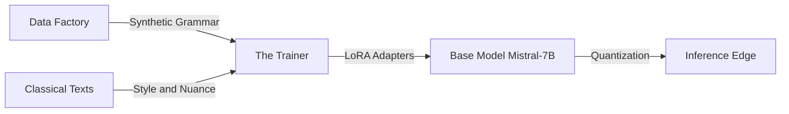

# Approach to Solution: Neuro-Symbolic Architecture

This architecture is **Neuro-Symbolic**: it uses a deterministic "Rule Engine" (Symbolic) to teach a probabilistic "Neural Network" (Neuro).

## 📚 Learning Resources

The best resource for students to visualize this interaction is the recent practical breakdown of **Neuro-Symbolic AI in the Era of LLMs**.

This video is superior for "homework" because it doesn't just talk theory; it demonstrates how to enforce structured logic (like Panini's grammar) onto the probabilistic output of an LLM.

- [**Neuro-Symbolic AI in the Era of LLMs**](https://www.youtube.com/watch?v=cVRNIRZ5K24)

This video perfectly illustrates the "Panini-1" concept by showing how to combine the reliability of rule-based logic (Knowledge Graphs/Constraints) with the flexibility of Large Language Models.

- [**Theoretical Knowledge - Neuro-Symbolic AI**](https://www.youtube.com/watch?v=9Jc3g6sPpUU)

---

## 🛠️ Tech Stack

- **Language**: Python (Orchestration), Rust (Performance - using Vidyut libraries)
- **Containerization**: Docker (essential for students to run this without "dependency hell")
- **Compute**: Single Consumer GPU (NVIDIA RTX 3090/4090, 24GB VRAM)

---

## 🏗️ Architecture Diagram



---

## A. The Data Factory (The "Panini Engine")

**Objective:** Generate infinite, grammatically perfect Sanskrit text.

**Core Technology:** Python scripts calling Rust-based libraries (e.g., Vidyut or Dhatupatha parsers).

**Pipeline:**

1. **Root Selection:** Select verbal roots (dhatu) and nominal bases (pratipadika).
2. **Rule Application:** Apply Paninian rules for derivation (e.g., Sandhi, Subanta, Tinganta).
3. **Output:** A dataset of JSONL pairs:
   ```json
   {
     "input": "Root + Grammar Rules",
     "output": "Perfectly Formed Sentence"
   }
   ```

**Raw Source:** Panini's Ashtadhyayi (JSON/XML) + Dhatupatha (Roots).

**Generator (Rust/Python):** A script that systematically applies rules (Sandhi, Samasa, Subanta) to roots to generate millions of grammatically perfect synthetic sentences.

**Curator:** A mixing script that blends:

- **50% Synthetic** (Perfect Grammar)
- **30% Classical** (Kalidasa, Mahabharata)
- **20% Modern** (Wikipedia/News) for contemporary vocabulary

---

## B. The Trainer (The "Classroom")

**Objective:** Teach the model to generalize style and meaning.

**Core Technology:** Unsloth (for efficient training) + PyTorch.

**Hardware Target:** Single NVIDIA RTX 3090/4090 (24GB VRAM).

**Methodology:**

1. **Base Model:** Load Mistral-7B or Llama-3-8B (Quantized to 4-bit).
2. **LoRA Adapters:** Train only 1-2% of the model parameters (the "Adapter" layers) on the synthetic data.
3. **Curriculum Learning:** Start with simple grammar (Synthetic), move to complex literature (Kalidasa), end with modern usage (News/Wiki).

**Base Model:** Mistral-7B or Llama-3-8B (pre-trained weights).

**LoRA Adapter:** A small, trainable layer (approx. 100MB) that sits on top of the base model. This is the only part we update, keeping VRAM usage under 24GB.

**Loss Function:** Standard Causal Language Modeling (CLM) loss, but potentially weighted to penalize grammatical errors more heavily.

---

## C. The Inference Edge (The "Application")

**Objective:** Run the model on a laptop.

**Core Technology:** llama.cpp (GGUF format).

**Interface:** Simple Python web app (Streamlit) or Terminal CLI.

**Quantizer:** Convert the final model to GGUF (4-bit) format.

**Runtime:** llama.cpp (allows it to run on a MacBook or generic laptop).

**UI:** A simple Streamlit interface for chat/translation.

---

## 📋 Step-by-Step Data Generation Guide

This is the most critical part. We don't want to hand-label data; we want to synthesize it.

### Step 1: The "Digital Panini" (Infrastructure)

Don't write the grammar rules from scratch. Use **Vidyut**, an open-source Rust ecosystem for Sanskrit. It is incredibly fast and handles the heavy lifting of Paninian derivation.

**Action:** Clone the vidyut repo from GitHub.

**Task for Students:** Write Python bindings for vidyut-prakriya (if they don't fully exist) to expose the word generator to your data pipeline.

### Step 2: The "Sandhi" Synthetic Generator

Sanskrit is agglutinative; words stick together. LLMs struggle with this.

**The Script:** Write a Python script that takes two valid words (e.g., Deva + Alaya) and applies the Sandhi rule to create the combined form (Devalaya).

**The Dataset:** Generate 100,000 pairs of Input: "Deva Alaya" -> Target: "Devalaya".

**Why:** This "pre-teaches" the model tokenization logic before it even tries to understand meaning.

### Step 3: The "Shloka" Scraper

**Source:** [GRETIL](http://gretil.sub.uni-goettingen.de/gretil.html) (Goettingen Register of Electronic Texts in Indian Languages) or the [cltk](https://github.com/cltk/cltk) (Classical Language Toolkit) archives.

**Cleaning:** Use a script to strip verse numbers and metadata.

**Task:** "Un-Sandhi" the text using Vidyut or SanskritShala segmenters to create a "Simple Sanskrit" version of the complex text.

### Step 4: The Formatting (JSONL)

Prepare the data in the standard Alpaca or ChatML format for fine-tuning.

**Example Format:**

```json
{
  "role": "user",
  "content": "Translate this to Sanskrit: 'The sun rises in the east.'"
}
```

```json
{
  "role": "assistant",
  "content": "सूर्यः पूर्वस्यां दिशि उदेति (Suryah purvasyam dishi udeti)"
}
```

**ChatML Format (Alternative):**

```jsonl
{"messages": [{"role": "user", "content": "Translate this to Sanskrit: 'The sun rises in the east.'"}, {"role": "assistant", "content": "सूर्यः पूर्वस्यां दिशि उदेति (Suryah purvasyam dishi udeti)"}]}
```

---

*Approach to Solution - Project Panini*  
*Last Updated: January 16, 2026*
