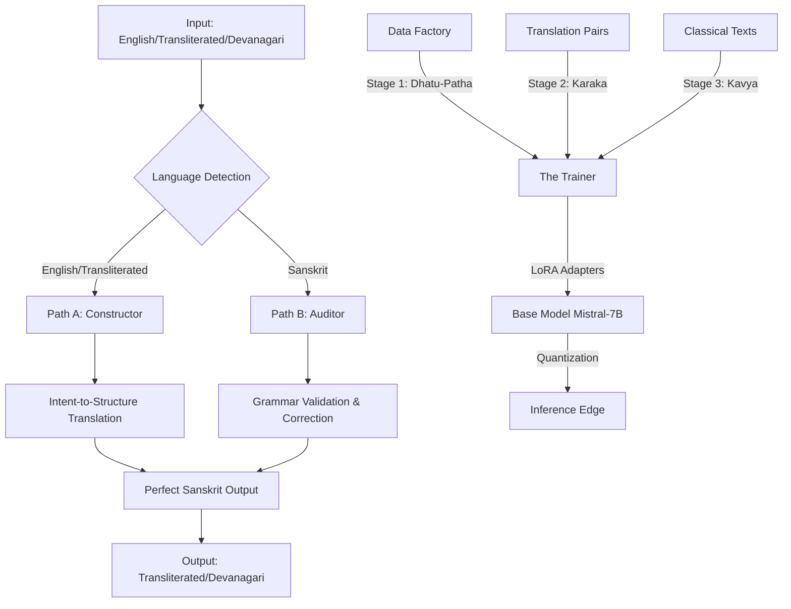

# Project Panini: Neuro-Symbolic Sanskrit SLM 🕉️

  

**Panini-1** is an open-source initiative to build the **Paninian Engine**—a Neuro-Symbolic system that constructs Sanskrit according to strict Paninian rules rather than just predicting the next word.

Unlike standard LLMs that require millions of dollars to "guess" grammar from massive datasets, we use a **Neuro-Symbolic** approach. The Paninian Engine operates as:

- **Translator** for English inputs → Perfect Sanskrit output (Path A: Constructor)
- **Validator** for Sanskrit inputs → Grammar correction and validation (Path B: Auditor)

We teach the model the deterministic rules of Panini's *Ashtadhyayi* (c. 500 BCE) through curriculum learning, allowing us to achieve high accuracy on minimal hardware (consumer gaming GPUs).

---

## 🏗️ Architecture

The **Paninian Engine** uses a dual-path Neuro-Symbolic architecture that constructs Sanskrit according to strict Paninian rules rather than just predicting the next word.



### Dual-Path System

- **Path A (Constructor)**: English/Transliterated Sanskrit → Perfect Sanskrit Output
  - Intent-to-Structure translation (not statistical mapping)
  - Extracts semantic roles (Karaka) and applies Paninian rules
  - Example: "The boy reads" → "Baalah pathati"

- **Path B (Auditor)**: Sanskrit (transliterated or Devanagari) → Grammar Validation
  - Validates and corrects Sanskrit grammar
  - Applies Paninian rule checking
  - Example: "Ramena gacchati" → "Ramah gacchati" (corrected)

### Training Pipeline

- **The Data Factory**: Generates curriculum learning data in 3 stages using Panini's algorithms (via Vidyut)
  - Stage 1: Dhatu-Patha (Morphology) - Word formation from roots
  - Stage 2: Karaka (Syntax & Translation) - English-to-Sanskrit translation
  - Stage 3: Kavya (Style & Essays) - Long-form generation

- **The Trainer**: Uses Unsloth and LoRA (Low-Rank Adaptation) with curriculum learning to fine-tune a Mistral-7B model on a single RTX 3090/4090.

- **The Edge**: The final model is quantized to 4-bit (GGUF) to run on standard laptops via llama.cpp with dual-path capabilities.

---

## 🎯 Goals

- **Minimal Compute**: Train a fluent Sanskrit model for <$500.
- **Academic Rigor**: Combine Neural Networks (Probabilistic) with Paninian Grammar (Deterministic).
- **Grammar Guarantee**: Construct grammatically perfect Sanskrit using Intent-to-Structure translation.
- **Multi-Script Support**: Handle English, transliterated Sanskrit, and Devanagari inputs/outputs.
- **Accessibility**: Run the final model on a MacBook or local PC.

---

## 🛠️ Tech Stack

- **Base Model**: Mistral-7B or Llama-3-8B
- **Fine-Tuning**: Unsloth (2x faster, 60% less memory)
- **Sanskrit Engine**: Vidyut (Rust-based Paninian engine)
- **Inference**: llama.cpp

---

## 🚀 Getting Started

### Prerequisites

- Python 3.10+
- CUDA-enabled GPU (8GB+ VRAM for inference, 24GB for training)

### Installation

```bash
git clone https://github.com/your-username/panini-slm.git
cd panini-slm
pip install -r requirements.txt
```

---

## 🤝 Contributing

We specifically need help from Computer Science and Linguistics students for:

- **Data Engineering**: Writing Python wrappers for Sanskrit grammar rules.
- **Corpus Cleaning**: Parsing texts from Kalidasa and the Mahabharata.
- **Evaluation**: Creating "Gold Standard" test sets to verify grammatical accuracy.

See [CONTRIBUTING.md](docs/contributing.md) for details.

---

## 📚 Documentation

- [Paninian Engine Architecture](docs/PANINIAN_ENGINE_ARCHITECTURE.md) - **Dual-path architecture** (Constructor + Auditor) with multi-script support
- [Approach to Solution](docs/approach-to-solution.md) - **Updated:** Neuro-symbolic architecture with curriculum learning
- [Project Overview](docs/panini-neuro-symbolic-ai.md) - Detailed project description
- [Solution Architecture](docs/SOLUTION_ARCHITECTURE.md) - Complete system architecture for consumer hardware
- [Contributing Guide](docs/contributing.md) - How to contribute to the project

---

## 📄 License

This project is licensed under the MIT License - see the LICENSE file for details.

---

*Project Panini - Neuro-Symbolic AI for Sanskrit*  
*Last Updated: January 16, 2026*
