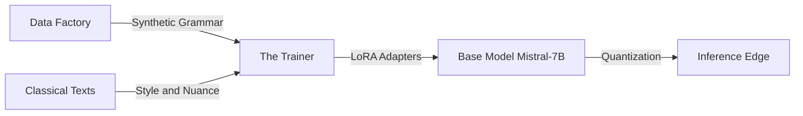

# Project Panini: Neuro-Symbolic Sanskrit SLM 🕉️

  

**Panini-1** is an open-source initiative to build a high-fidelity Small Language Model (SLM) for Sanskrit.

Unlike standard LLMs that require millions of dollars to "guess" grammar from massive datasets, we use a **Neuro-Symbolic** approach. We teach the model the deterministic rules of Panini's *Ashtadhyayi* (c. 500 BCE) first, allowing us to achieve high accuracy on minimal hardware (consumer gaming GPUs).

---

## 🏗️ Architecture

Our pipeline minimizes compute costs by prioritizing data quality over parameter count.



- **The Data Factory**: A Rust/Python engine that generates millions of grammatically perfect Sanskrit sentences using Panini's algorithms (via Vidyut).
- **The Trainer**: Uses Unsloth and LoRA (Low-Rank Adaptation) to fine-tune a Mistral-7B model on a single RTX 3090/4090.
- **The Edge**: The final model is quantized to 4-bit (GGUF) to run on standard laptops via llama.cpp.

---

## 🎯 Goals

- **Minimal Compute**: Train a fluent Sanskrit model for <$500.
- **Academic Rigor**: Combine Neural Networks (Probabilistic) with Paninian Grammar (Deterministic).
- **Accessibility**: Run the final model on a MacBook or local PC.

---

## 🛠️ Tech Stack

- **Base Model**: Mistral-7B or Llama-3-8B
- **Fine-Tuning**: Unsloth (2x faster, 60% less memory)
- **Sanskrit Engine**: Vidyut (Rust-based Paninian engine)
- **Inference**: llama.cpp

---

## 🚀 Getting Started

### Prerequisites

- Python 3.10+
- CUDA-enabled GPU (8GB+ VRAM for inference, 24GB for training)

### Installation

```bash
git clone https://github.com/your-username/panini-slm.git
cd panini-slm
pip install -r requirements.txt
```

---

## 🤝 Contributing

We specifically need help from Computer Science and Linguistics students for:

- **Data Engineering**: Writing Python wrappers for Sanskrit grammar rules.
- **Corpus Cleaning**: Parsing texts from Kalidasa and the Mahabharata.
- **Evaluation**: Creating "Gold Standard" test sets to verify grammatical accuracy.

See [CONTRIBUTING.md](docs/contributing.md) for details.

---

## 📚 Documentation

- [Project Overview](docs/panini-neuro-symbolic-ai.md) - Detailed project description
- [Approach to Solution](docs/approach-to-solution.md) - Neuro-symbolic architecture and methodology
- [Solution Architecture](docs/SOLUTION_ARCHITECTURE.md) - Complete system architecture
- [Contributing Guide](docs/contributing.md) - How to contribute to the project

---

## 📄 License

This project is licensed under the MIT License - see the LICENSE file for details.

---

*Project Panini - Neuro-Symbolic AI for Sanskrit*  
*Last Updated: January 16, 2026*
